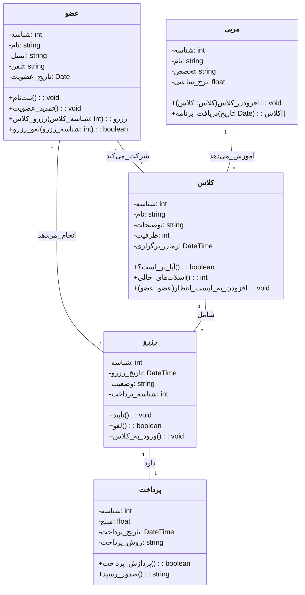

# نمودار کلاس سیستم باشگاه ورزش

```mermaid
classDiagram
    %% تعریف کلاس‌ها
    class عضو {
        -شناسه: int
        -نام: string
        -ایمیل: string
        -تلفن: string
        -تاریخ_عضویت: Date
        +ثبت‌نام(): void
        +تمدید_عضویت(): void
        +رزرو_کلاس(شناسه_کلاس: int): رزرو
        +لغو_رزرو(شناسه_رزرو: int): boolean
    }
    
    class مربی {
        -شناسه: int
        -نام: string
        -تخصص: string
        -نرخ_ساعتی: float
        +افزودن_کلاس(کلاس: کلاس): void
        +دریافت_برنامه(تاریخ: Date): کلاس[]
    }
    
    class کلاس {
        -شناسه: int
        -نام: string
        -توضیحات: string
        -ظرفیت: int
        -زمان_برگزاری: DateTime
        +آیا_پر_است؟(): boolean
        +اسلات‌های_خالی(): int
        +افزودن_به_لیست_انتظار(عضو: عضو): void
    }
    
    class رزرو {
        -شناسه: int
        -تاریخ_رزرو: DateTime
        -وضعیت: string
        -شناسه_پرداخت: int
        +تأیید(): void
        +لغو(): boolean
        +ورود_به_کلاس(): void
    }
    
    class پرداخت {
        -شناسه: int
        -مبلغ: float
        -تاریخ_پرداخت: DateTime
        -روش_پرداخت: string
        +پردازش_پرداخت(): boolean
        +صدور_رسید(): string
    }
    
    %% تعریف روابط بین کلاس‌ها
    عضو "1" -- "*" رزرو : انجام_می‌دهد
    عضو "*" -- "*" کلاس : شرکت_می‌کند
    مربی "1" -- "*" کلاس : آموزش_می‌دهد
    کلاس "1" -- "*" رزرو : شامل
    رزرو "1" -- "1" پرداخت : دارد
```