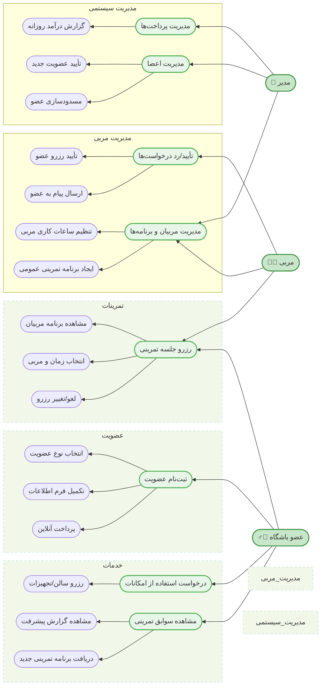

```mermaid
flowchart RL

%% 🎭 بازیگران
Member([🏋️‍♂️ عضو باشگاه])
Trainer([🧑‍🏫 مربی])
Admin([👤 مدیر])

%% 🧩 Use Cases اصلی
subgraph عضویت
    UC1([ثبت‌نام عضویت])
    UC1a([انتخاب نوع عضویت])
    UC1b([تکمیل فرم اطلاعات])
    UC1c([پرداخت آنلاین])
end

subgraph تمرینات
    UC2([رزرو جلسه تمرینی])
    UC2a([مشاهده برنامه مربیان])
    UC2b([انتخاب زمان و مربی])
    UC2c([لغو/تغییر رزرو])
end

subgraph خدمات
    UC3([درخواست استفاده از امکانات])
    UC3a([رزرو سالن/تجهیزات])
    UC4([مشاهده سوابق تمرینی])
    UC4a([مشاهده گزارش پیشرفت])
    UC4b([دریافت برنامه تمرینی جدید])
end

subgraph مدیریت مربی
    UC5([تأیید/رد درخواست‌ها])
    UC5a([تأیید رزرو عضو])
    UC5b([ارسال پیام به عضو])
    UC8([مدیریت مربیان و برنامه‌ها])
    UC8a([تنظیم ساعات کاری مربی])
    UC8b([ایجاد برنامه تمرینی عمومی])
end

subgraph مدیریت سیستمی
    UC6([مدیریت پرداخت‌ها])
    UC6a([گزارش درآمد روزانه])
    UC7([مدیریت اعضا])
    UC7a([تأیید عضویت جدید])
    UC7b([مسدودسازی عضو])
end


%% 🔗 ارتباطات بازیگران با Use Caseهای اصلی
Member --> UC1
Member --> UC2
Member --> UC3
Member --> UC4

Trainer --> UC2
Trainer --> UC5
Trainer --> UC8

Admin --> UC6
Admin --> UC7
Admin --> UC8

%% 🔗 ارتباطات زیرمجموعه‌ها با Use Case اصلی (فقط برای وضوح)
UC1 --> UC1a & UC1b & UC1c
UC2 --> UC2a & UC2b & UC2c
UC3 --> UC3a
UC4 --> UC4a & UC4b
UC5 --> UC5a & UC5b
UC8 --> UC8a & UC8b
UC6 --> UC6a
UC7 --> UC7a & UC7b


%% 🎨 ظاهر و استایل‌ها
style Member fill:#C8E6C9,stroke:#388E3C,stroke-width:2px
style Trainer fill:#C8E6C9,stroke:#388E3C,stroke-width:2px
style Admin fill:#C8E6C9,stroke:#388E3C,stroke-width:2px

%% استایل Use Caseهای اصلی (سبز روشن)
style UC1 fill:#E8F5E9,stroke:#4CAF50,stroke-width:2px
style UC2 fill:#E8F5E9,stroke:#4CAF50,stroke-width:2px
style UC3 fill:#E8F5E9,stroke:#4CAF50,stroke-width:2px
style UC4 fill:#E8F5E9,stroke:#4CAF50,stroke-width:2px
style UC5 fill:#E8F5E9,stroke:#4CAF50,stroke-width:2px
style UC6 fill:#E8F5E9,stroke:#4CAF50,stroke-width:2px
style UC7 fill:#E8F5E9,stroke:#4CAF50,stroke-width:2px
style UC8 fill:#E8F5E9,stroke:#4CAF50,stroke-width:2px


%% استایل گروه‌ها (Subgraphs)
style عضویت fill:#F1F8E9,stroke:#B2DFDB,stroke-dasharray: 5 5
style تمرینات fill:#F1F8E9,stroke:#B2DFDB,stroke-dasharray: 5 5
style خدمات fill:#F1F8E9,stroke:#B2DFDB,stroke-dasharray: 5 5
style مدیریت_مربی fill:#F1F8E9,stroke:#B2DFDB,stroke-dasharray: 5 5
style مدیریت_سیستمی fill:#F1F8E9,stroke:#B2DFDB,stroke-dasharray: 5 5

```