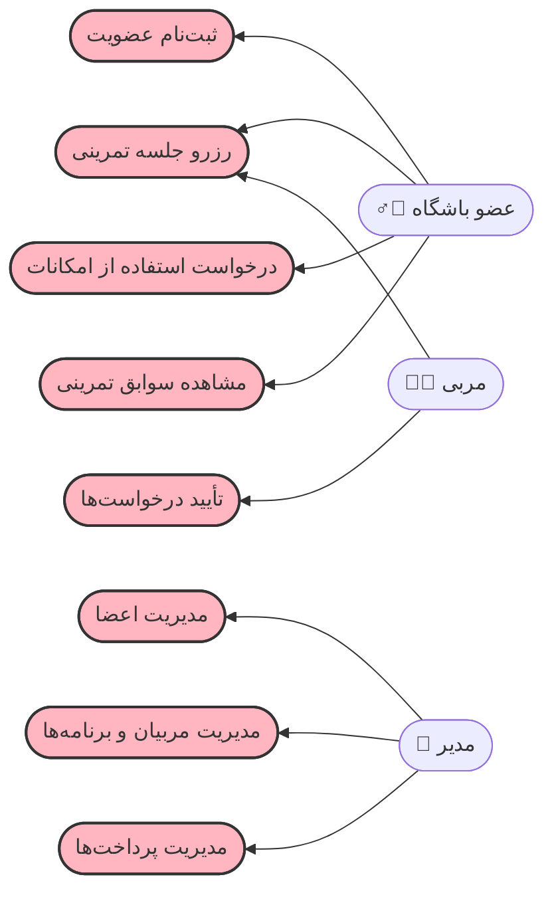

```mermaid
flowchart RL

%% بازیگران
Member([🏋️‍♂️ عضو باشگاه])
Trainer([🧑‍🏫 مربی])
Admin([👤 مدیر])

%% موارد استفاده (Use Cases)
UC1([ثبت‌نام عضویت])
UC2([رزرو جلسه تمرینی])
UC3([درخواست استفاده از امکانات])
UC4([مشاهده سوابق تمرینی])
UC5([تأیید درخواست‌ها])
UC6([مدیریت پرداخت‌ها])
UC7([مدیریت اعضا])
UC8([مدیریت مربیان و برنامه‌ها])

%% ارتباطات
Member --> UC1
Member --> UC2
Member --> UC3
Member --> UC4

Trainer --> UC2
Trainer --> UC5

Admin --> UC7
Admin --> UC8
Admin --> UC6

%% ظاهر بیضی‌ها (صورتی)
style UC1 fill:#FFB6C1,stroke:#333,stroke-width:2px
style UC2 fill:#FFB6C1,stroke:#333,stroke-width:2px
style UC3 fill:#FFB6C1,stroke:#333,stroke-width:2px
style UC4 fill:#FFB6C1,stroke:#333,stroke-width:2px
style UC5 fill:#FFB6C1,stroke:#333,stroke-width:2px
style UC6 fill:#FFB6C1,stroke:#333,stroke-width:2px
style UC7 fill:#FFB6C1,stroke:#333,stroke-width:2px
style UC8 fill:#FFB6C1,stroke:#333,stroke-width:2px
```