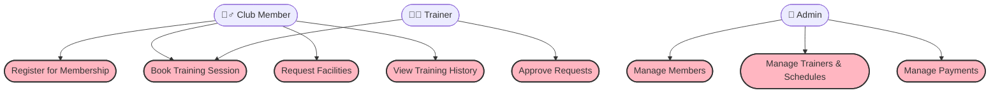

```mermaid
flowchart TD

    %% Actors
    Member([🏋️‍♂️ Club Member])
    Trainer([🧑‍🏫 Trainer])
    Admin([👤 Admin])

    %% Use Cases styled as ellipse (GitHub-friendly)
    UC1([Register for Membership])
    UC2([Book Training Session])
    UC3([Request Facilities])
    UC4([View Training History])
    UC5([Approve Requests])
    UC6([Manage Payments])
    UC7([Manage Members])
    UC8([Manage Trainers & Schedules])

    %% Connections
    Member --> UC1
    Member --> UC2
    Member --> UC3
    Member --> UC4

    Trainer --> UC2
    Trainer --> UC5

    Admin --> UC7
    Admin --> UC8
    Admin --> UC6

    %% Pink oval style (works in GitHub)
    style UC1 fill:#FFB6C1,stroke:#333,stroke-width:2px
    style UC2 fill:#FFB6C1,stroke:#333,stroke-width:2px
    style UC3 fill:#FFB6C1,stroke:#333,stroke-width:2px
    style UC4 fill:#FFB6C1,stroke:#333,stroke-width:2px
    style UC5 fill:#FFB6C1,stroke:#333,stroke-width:2px
    style UC6 fill:#FFB6C1,stroke:#333,stroke-width:2px
    style UC7 fill:#FFB6C1,stroke:#333,stroke-width:2px
    style UC8 fill:#FFB6C1,stroke:#333,stroke-width:2px
```